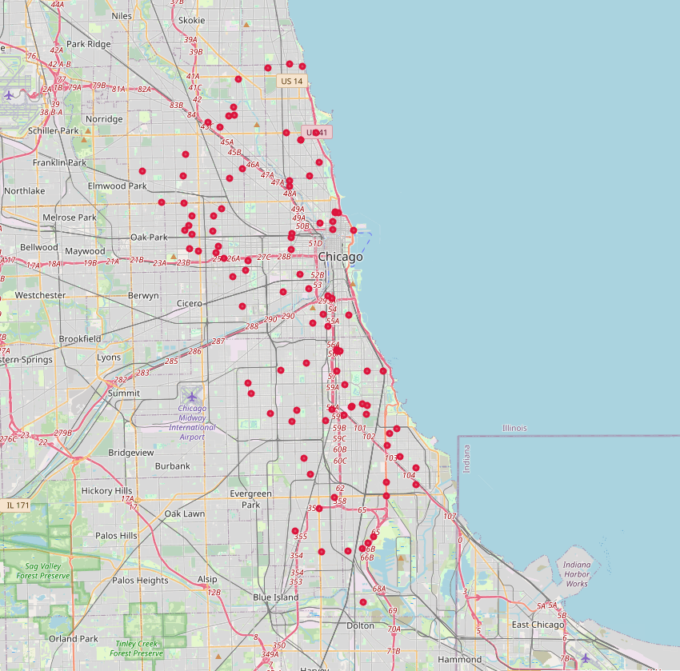
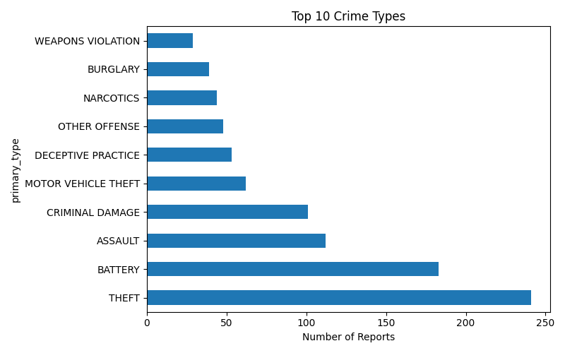
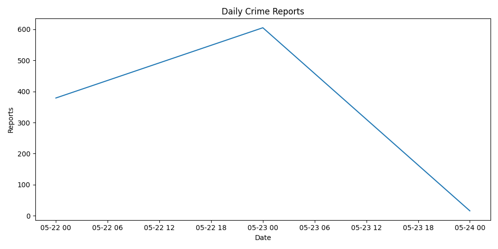

# Chicago Crime Data API Analysis

This project uses live data from the [City of Chicago Crime API](https://data.cityofchicago.org/resource/ijzp-q8t2.json) to analyze and visualize crime trends.

## 🔍 Features

- 🔗 API integration (live JSON pulled from Chicago)
- 📊 Top 10 crime types bar chart
- 📈 Daily crime reports trend line
- 🗺️ Interactive map (100 crimes plotted)
- 🔍 Violent crime filter (assault, battery, etc.)
- 💾 CSV + image + HTML export

### Interactive Crime Map


➡️ Open the full interactive map here: `CrimeData/chicago_map.html`


### Top 10 Crime Types


### Daily Crime Trend


### Interactive Map
➡️ Open `CrimeData/chicago_map.html` in your browser.

## 🛠 Tech Stack

- Python 3.12
- Pandas
- Requests
- Matplotlib
- Folium
- Git + GitHub

## 🚀 How to Run

1. Clone the repo
2. Run:
   ```bash
   pip install -r requirements.txt
   python main.py
